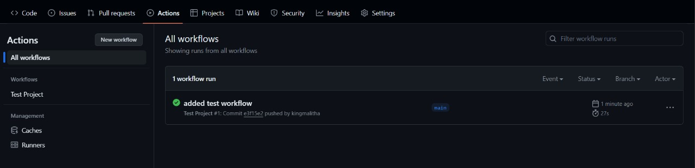
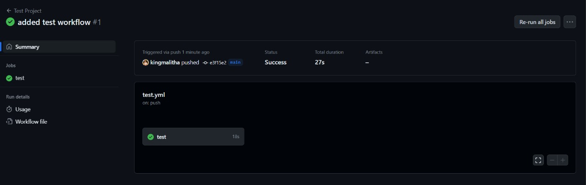
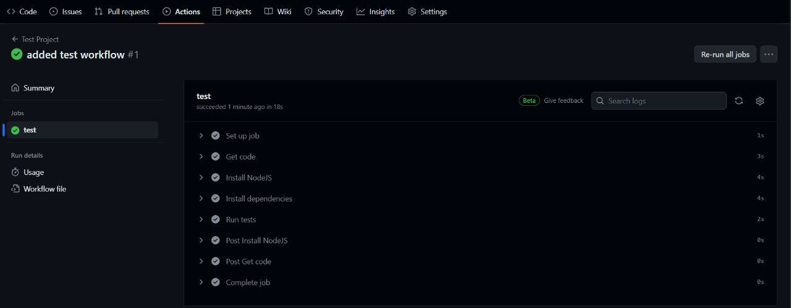
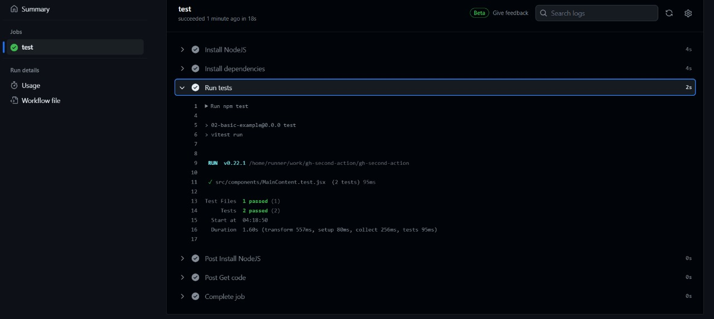
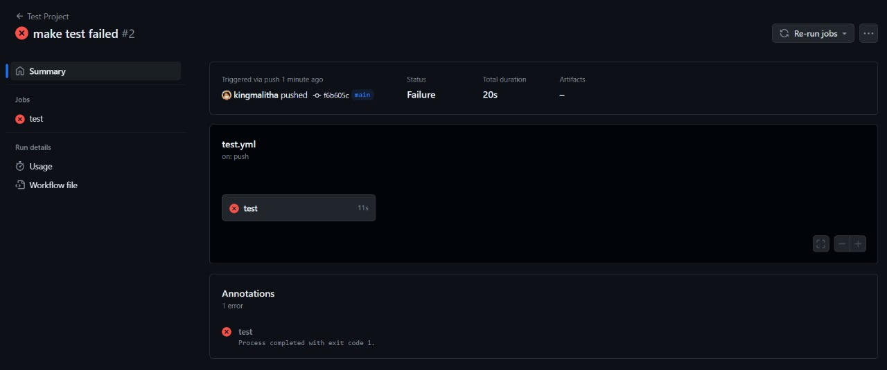
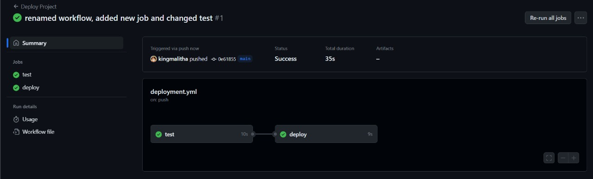

# GITHUB SECOND ACTION

- This is a simple GitHub action that will run tests on a react demo app when a new push is made to the repository.

- This is a part of the main repository [learn-github-actions](https://github.com/kingmalitha/learning-github-actions) which is a collection of GitHub actions that I have created to learn how to use GitHub actions.

## STEPS

- Only code is explained here. For intial setup and other details, please refer to the first action in the main repository.

- The action is triggered when a push is made to the repository. Events that triggers workflows are also explained in the main repository.

  ```yml
  name: Test Project
  on: push # This action runs when a push is made to the repository
  jobs:
  test:
      runs-on: ubuntu-latest
      steps:
      - name: Get code
          uses: actions/checkout@v4
      - name: Install NodeJS
          uses: actions/setup-node@v4
          with:
          node-version: 18
      - name: Install dependencies
          run: npm ci
      - name: Run tests
          run: npm test

  ```

  - Step `Install NodeJS` is a optional step. As we are using ubuntu-latest runner, NodeJS is already installed.
  - Step `Install dependencies` installs the dependencies of the project.

    - `npm ci` is used to install the dependencies from the `package-lock.json` file.
    - This is a faster and more reliable way to install dependencies.
    - You can use `npm install` if you want to install the dependencies from `package.json` file.But it is recommended to use `npm ci` in a CI/CD pipeline.

- If you want to get details infroamtion about the actions, please refer to the [marketplace](https://github.com/marketplace) and search for the action name.

- If you are using a `private` repository, you need to use a personal access token to authenticate the workflow. You can create a personal access token from the settings of your GitHub account.











## ADDING ANOTHER JOB

```yml
name: Deploy Project
on: [push, workflow_dispatch] # can add multiple events triggers
jobs:
  test:
    runs-on: ubuntu-latest
    steps:
      - name: Get code
        uses: actions/checkout@v4
      - name: Install NodeJS
        uses: actions/setup-node@v4
        with:
          node-version: 18
      - name: Install dependencies
        run: npm ci
      - name: Run tests
        run: npm test
  deploy:
    runs-on: ubuntu-latest
    needs: test # This job needs to run after the test job
    steps:
      - name: Get code
        uses: actions/checkout@v4
      - name: Install NodeJS
        uses: actions/setup-node@v4
        with:
          node-version: 18
      - name: Install dependencies
        run: npm ci
      - name: Build project
        run: npm run build
      - name: Deploy project
        run: echo "Deploying project"
```

- The `deploy` job runs after the `test` job. The `needs` keyword is used to specify that the `deploy` job needs to run after the `test` job. So this is sequential execution of jobs.



## EXPRESSIONS & CONTEXT OBJECTS

- You can use expressions and context objects to access the data of the workflow.

```yml
name: Output information
on: workflow_dispatch
jobs:
  info:
    runs-on: ubuntu-latest
    steps:
      - name: Output GitHub context
        run: echo "${{ toJson(github)}}"
```
